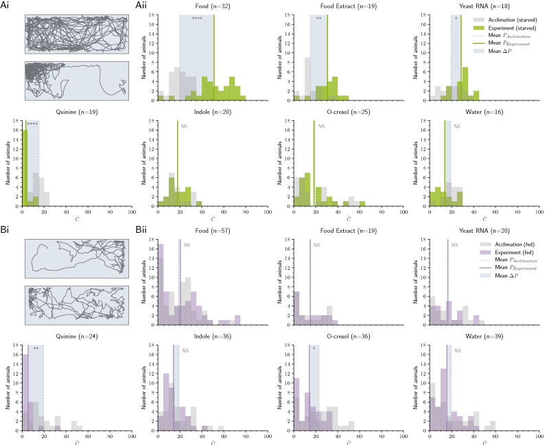
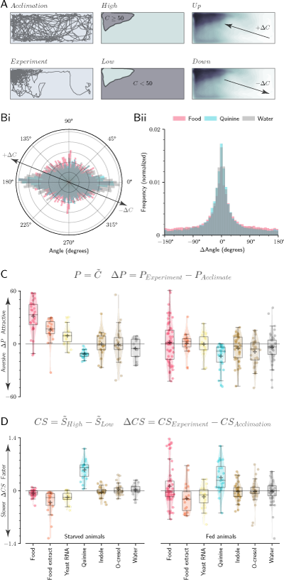
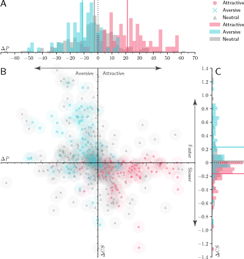
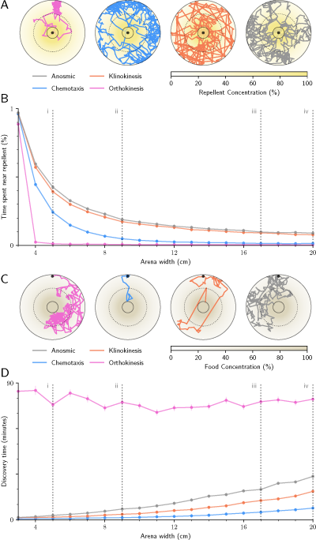
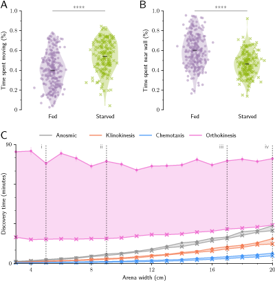
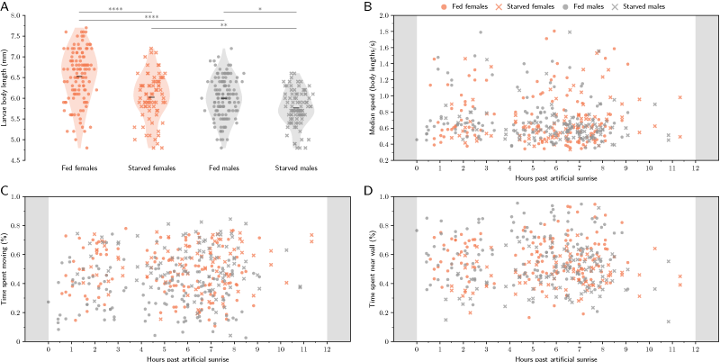
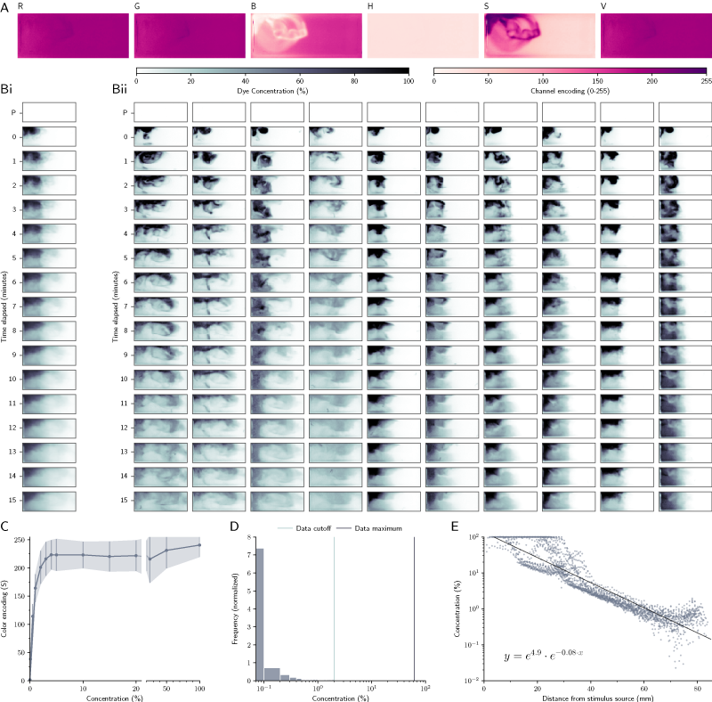
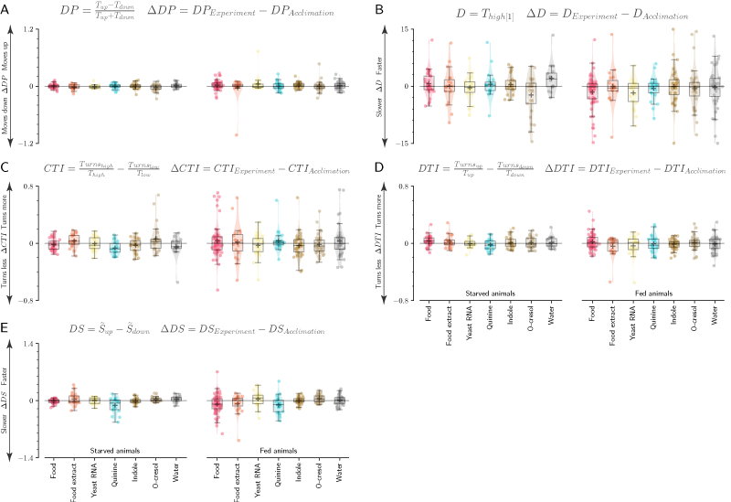
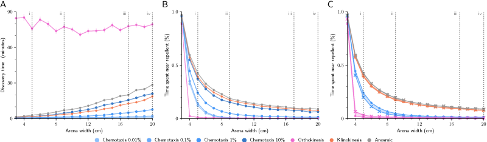
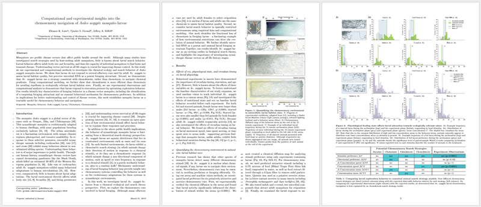

# Computational and experimental insights into the chemosensory navigation of *Aedes aegypti* mosquito larvae

**Authors and Affiliations:** Eleanor K. Lutz1, Tjinder Grewal2, [Jeffrey A. Riffell](http://faculty.washington.edu/jriffell/)1†

1. Department of Biology, University of Washington, Seattle, WA 98195, USA.
2. Department of Bioengineering, University of Washington, Box 355061, Seattle, WA 98195, USA
  - † To whom all correspondence should be addressed

This paper was originally submitted to BioRxiv on March 21, 2019. Data collected and analyzed in this manuscript can currently be found in this [Google Drive folder](https://drive.google.com/drive/folders/1I2kDHNNdvXw6LSiaCOCeElc4iEj74Iu1?usp=sharing) and will be moved to a permanent repository during manuscript submission and review. A brief explanation or visualization of each code file is provided below.

### Figure Generation Code:
#### F_plot_figure_1.ipynb

#### F_plot_figure_2.ipynb

#### F_plot_figure_3.ipynb

#### F_plot_figure_4.ipynb

#### F_plot_figure_5.ipynb

#### F_plot_figure_6.ipynb

#### F_plot_figure_S1.ipynb

#### F_plot_figure_S2.ipynb

#### F_plot_figure_S3.ipynb

#### F_plot_figure_S4.ipynb

### Data Analysis Code:
#### 0_inspect_data.ipynb
- Remove dead larvae and experiments that were accidentally begun before the larval daylight cycle.
- Convert experiment start time to number of minutes elapsed since light cycle ON time
- Save cleaned dataset in a new `CSV` file.
- Check that the number of fed and starved animals in each experiment adds up to the total number of animals.
- Output the number of animals in each experiment (total) and the number of fed and starved animals for each experiment as a TXT file
- Check that each experiment larva has one video HDF5 file and one folder

#### 1_convert_hdf5_to_csv.ipynb
- Translate Multitracker hdf5 files into Pandas dataframes and save to CSV
- Double check that all animals have one acclimate and experiment CSV file
- Find videos with quiescent animals at beginning of video
- Manually correct videos with quiescent animals at beginning of video

#### 2_analyze_fluorescein_images.ipynb
- Examine experimental image to see which encoding best captures differences in color
- Bin experimental photographs into 1mm x 1mm segments. This is done to normalize between photos that are a different number of pixels wide. Each bin is represented by the mean saturation value (S) of all pixels within that 1mm x 1mm segment. Save these reduced data files into a new folder.
- Subtract the Saturation value in the blank image from the corresponding experiment image for each experiment series. This is done to correct for potential differences in lighting between photographs or experiments.
- Similarly, subtract the Saturation value in the blank image from the corresponding experiment image for each standardization image.
- Combine the data from all 1mm x 1mm cells for all standardization images into a single file
- Create a master dataframe of statistics for the standardization dataset
- Create a threshold of concentration for the experimental dataset to use as the 100% dye value
- Create a linear interpolation between color (HSV saturation) and concentration using the reference dataset
- Use the interpolation between color and concentration to map each experimental saturation value to concentration
- Average the concentration calculations for every time unit (1min, 2min, etc) across all 10 experiments with larvae
- Average the concentration calculations for every time unit across all 10 experiments without larvae
- Create a master dataframe containing the concentration in each bin across all 15 minutes
- Create a file containing distances of all bins from the odor source for experiments with larvae (for use in computational modeling)
- Create files to analyze differences in diffusion between experiments with and without larvae
- Fit an exponential line to the distance and concentration dataset for modeling purposes.

#### 3_calculate_trajectory_properties.ipynb
- Add the size of each larvae into the trajectory CSV file
- Convert pixel locations to mm
- Zero out any off-screen values to the limits of the behavior arena
- Calculate instantaneous speed in mm per second
- Calculate instananeous angle (from horizontal, countercounterclockwise, in degrees)
- Calculate instantaneous change in heading (angle)
- Calculate the predicted concentration of chemical in the arena experienced by the larva at each time point
- Calculate whether or not the larvae is within 1 body length of the wall at all time points

#### 4_calculate_analyses_values_per_larvae.ipynb
- Calculate various characteristics of larval behavior including P, CS, CTI, etc.
- Stack the acclimation and experiment dataframes horizontally for further analysis
- After reviewing the preferences of larvae for each odor, assign each odor as Aversive, Apetitive, or Neutral.

#### 5_statistical_analyses.ipynb
- Print out the n values for each treatment for reference
- Compare physiological (length) differences between males, females, and fed vs starved larvae
- Compare larval activity to time of day
- Compare differences between fed and starved larvae in behavioral metrics
- Calculate the preference value for each stimulus for both fed and starved larvae
- Compare behavioral metrics for neutral, aversive, and appetitive cues
- Compare the effect of larval presence on dye diffusion over time
- Assess fit of the regression line used to fit distance to concentration for simulations
- Adjust all tests using the Holm-Bonferroni correction

#### 6_combine_trajectory_data_for_modeling.ipynb
- Output 4 dataframe combining all animal trajectories: Fed animals acclimation phase, Fed animals experiment phase, Starved animals acclimation phase, and Starved animals experiment phase

#### 7_run_models.ipynb
- Run simulation tasks using empirical data from starved animals
- Run simulation tasks using empirical data from fed animals

#### 8_analyze_model_success.ipynb
- Compare the amount of time (minutes) taken by each simulated strategy to find food
- Compare the amount of time (% total) each search strategy simulation spent in areas of high toxin concentration
- Compare simulations run using data from starved animals and data from fed animals: Foraging task
- Compare simulations run using data from starved animals and data from fed animals: Toxin avoidance task

### Manuscript Preparation Code:
#### latex_manuscript

